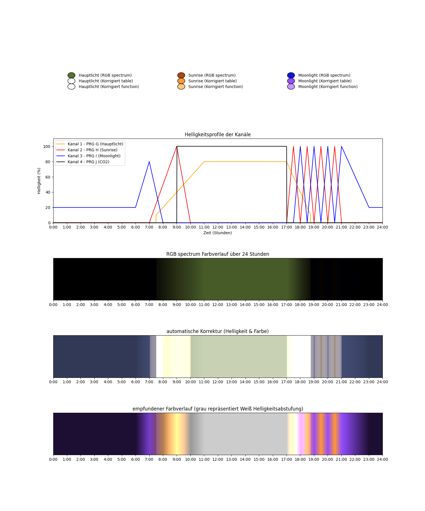

# LED Aquarium Beleuchtungsprogarmme Simulation

## Projektbeschreibung
Dieses Projekt simuliert die Steuerung eines mehrkanaligen Beleuchtungssystems für ein Aquarium. Es umfasst die Erstellung von Zeitprogrammen für die Steuerung der Helligkeit und Farben verschiedener Kanäle (z. B. Hauptlicht, Sonnenaufgang und Mondlicht) im Laufe des Tages. Das System berücksichtigt Helligkeit, Farben und Übergänge zwischen verschiedenen Beleuchtungseinstellungen.

Das Projekt ermöglicht eine detaillierte Simulation der Beleuchtungsszenarien, die auf einem Diagramm über den Verlauf von 24 Stunden dargestellt wird.

## warum macht jemand so etwas banales?
Wir haben uns eine neue 3 Kanal LED Aquarium Beleuchtung zugelegt 
damit kann man wirklich die Pflanzen / Steine und natürlich auch die Fische wunderschön in Szene setzen

Nach einigen Versuchen zur Planung und Diksussion der Steuerungszeiten erst auf Papier und dann mit Excel
habe ich für meine Frau eine Visualisierung geschrieben 

Die Programme werden ähnlich wie in der Steuerung definiert. 
Die Simulation stellt nun die An und Ausschaltzeiten inklusive Rampen dar und man kann anhand des Plots schön diskutieren ob doch etwas früher / später , mehr / weniger ...

Nachdem ich jetzt schon mehrfach gefragt wurde ob ich den code mal schicken kann habe ich (eigentlich meine Frau für mich) beschlossen es online zu stellen.

Das Ganze sieht dan in etwa so aus:



## Installation
Klone das Repository:
   ```bash
   git clone https://github.com/MonkeyCodeMen/AquariumLedLeuchte.git
```
oder ihr kopiert das File einfach über die Web Oberfläche von GitHub wohin ihr wollt

## was bnötigt man zum Ausführen ? (Abhänigkeiten)
```
1. Python 3.7+ (Versoin relativ egal)
2. matplotlib (für die Visualisierung)
3. numpy 
```
ich möchte hier keine Werbung machen aner WinPython ist ein schönes Paket alles aus einer Hand und Spyder ist wirklich ein hervorragendes Tool, unglaublich dass es so etwas für free gibt 

## kann man das script anpassen ?
klar sonst würde ich es ja nicht online stellen

### Lampe
als erstes sollte ihr eure Lampe definieren
```
#################################################
# powerbeam 3K Leuchte RGB werte aus Datenblatt LED aquaristik
### Hauptlicht   R:35%  G:45% B:20%
# R: hex(int(255*35/100)) = 0x59
# G: hex(int(255*45/100)) = 0x72
# B: hex(int(255*20/100)) = 0x33
### Sunrise      R:67%  G:29% B:5%
# R: hex(int(255*67/100)) = 0xAA
# G: hex(int(255*29/100)) = 0x49
# B: hex(int(255*5 /100)) = 0x0C
### Moonlight    R:5%  G:10% B:86%
# R: hex(int(255*5 /100)) = 0x0C
# G: hex(int(255*10/100)) = 0x19
# B: hex(int(255*86/100)) = 0xDB

# Kanal- und Farbzuteilung (Original RGB-Werte)
original_channel_colors = [
    to_rgb("#597233"),  # powerBeam 3K Leuchte Hauptlicht
    to_rgb("#AA490C"),  # powerBeam 3K Leuchte Sunrise
    to_rgb("#0C19DB"),  # powerBeam 3K Leuchte Moonlight   
    to_rgb("#000000")   # CO2 Ventil Kanal
]
```

die RGB Darstellung zeigt euch hauptsächlich wann ihr CO2 einschalten solltet

für die visuelle Dartsellung passt die Farben der korrigierten Tabelle so an wie sie bei euch im Aquarium wirken:´´
```
# Korrigierte RGB-Werte .. Farben Wirkung für Betrachter am Aquarium (subjektiv) 
corrected_channel_colors = [
    to_rgb("#FFFFFF"),  # Angepasste Farbe für Hauptlicht
    to_rgb("#FF9933"),  # Angepasste Farbe für Sunrise
    to_rgb("#944DFF"),  # Angepasste Farbe für Moonlight
    to_rgb("#000000")   # CO2 Ventil Kanal
]
```

### Programme
die Programme habe ich so aufgebaut wie sie in meiner Steuerung eingegeben werden (kann bei euch anders sein)
```

# AblaufListe   17:30 ==> 17.5
AblaufListe = {
    'PRG G (Hauptlicht)': [
        (0,   0.0),    # a new day is born
        (7,   0.0),    # Beginn Morgendämmerung
        (11,  0.8),    # maximum für den Tag erreicht
        (17,  0.8),    # bis 17:00 halten
        (19,  0.0)     # Hauptlicht wieder runter dimmen
    ],
    'PRG H (Sunrise)': [
        (0,   0.0),    # a new day is born
        (7,   0.0),    # Beginn Morgendämmerung
        (9,   1.0),    # Morgendämmerung max
        (10,  0.0),     
        (17,    0.0),    # Sonnenuntergang Lichtspiel / mehrmals
        (17.5,  1.0),    
        (18,    0.0),    
        (18.5,  1.0),    
        (19,    0.0),    
        (19.5,  1.0),    
        (20,    0.0),    
        (20.5,  1.0),    
        (21,    0.0)
    ],
    'PRG I (Moonlight)': [
        (0,   0.2),    # a new day is born
        (6,   0.2),    # Mond tritt ab
        (7,   0.8),    # noch mal hoch für Farbeffekt
        (8,   0.0),    # Tagsüber aus
        (17.5, 0.0),   # mehrmaliges Sonnuntergang / Mondspiel
        (18.0, 1.0),
        (18.5, 0.0),
        (19.0, 1.0),
        (19.5, 0.0),
        (20.0, 1.0),
        (20.5, 0.0),
        (21.0, 1.0),
        (23.0, 0.2)     # halte einen Level von 20% über Nacht
    ],
    'PRG J (CO2)': [
        (0,     0.0),    # a new day is born
        (9,     0.0),    # bis Lichthauptphase CO2 aus
        (9.01,  1.0),    # sehr kurze Rampe auf 100%
        (17,    1.0),    # halten
        (17.01, 0.0)     # kurze Rampe auf aus und bleibt aus
    ]
}
```

## LIZENZ

MIT License

Copyright (c) [2024] [Stefan Menninger]

Hiermit wird ausdrücklich gestattet, ohne Einschränkung, einschließlich, aber nicht beschränkt auf das Recht, den Code zu benutzen, zu kopieren, zu ändern, zu vertreiben und/oder zu verkaufen, solange die oben genannte Urheberrechtserklärung und diese Lizenz in allen Kopien oder wesentlichen Teilen der Software enthalten sind.

DIE SOFTWARE WIRD OHNE GARANTIE ODER ZUSICHERUNG JEGLICHER ART, AUSDRÜCKLICH ODER IMPLIZIT, EINSCHLIESSLICH, ABER NICHT BEGRENZT AUF DIE GARANTIEN DER MARKTGÄNGIGKEIT, EIGNUNG FÜR EINEN BESTIMMTEN ZWECK UND NICHTVERLETZUNG DER RECHTE GELIEFERT. IM KEINEN FALL HAFTEN DIE AUTOREN ODER RECHTSEINHABER FÜR ANSPRÜCHE, SCHÄDEN ODER ANDERE HAFTUNGEN, OB IN EINEM VERTRAGSVERHÄLTNIS, DELIKT ODER ANDERS, DIE AUS DER BENUTZUNG DER SOFTWARE ENTSTEHEN.


